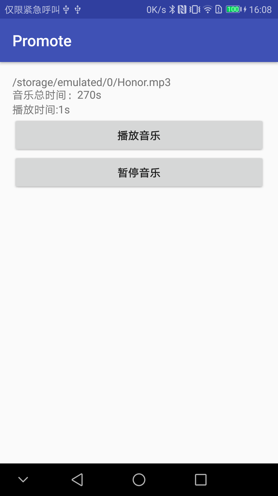
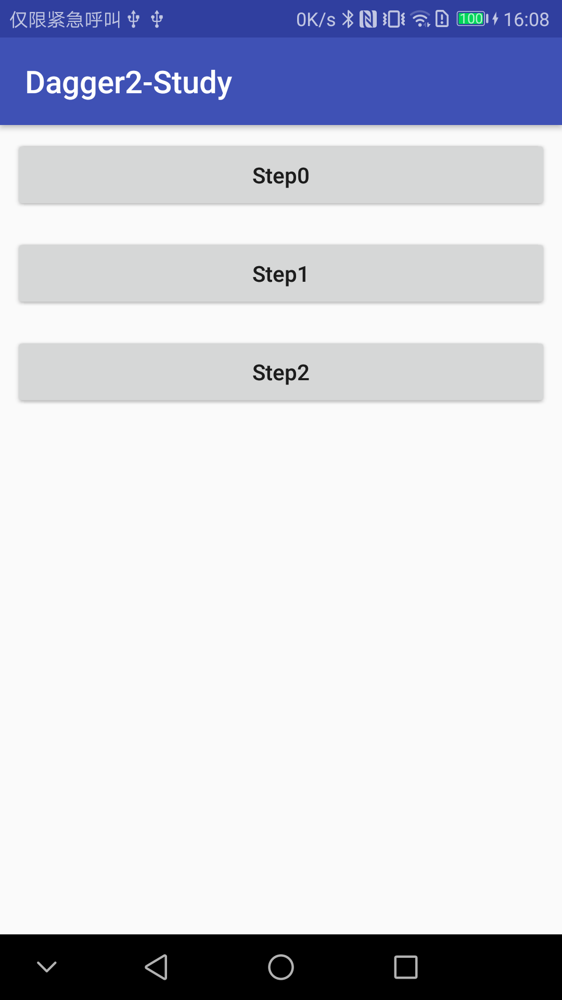
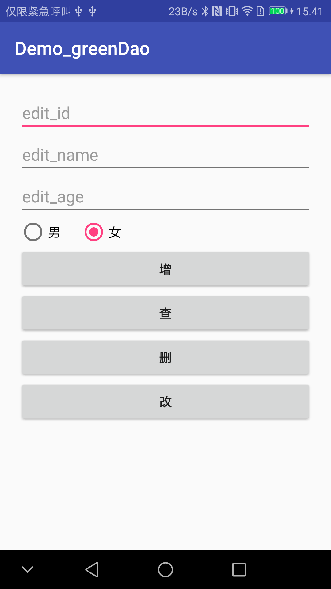
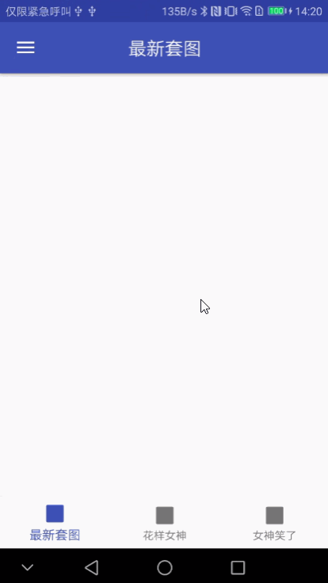

# AndroidStudy
随便记录一下Android学习中的一些问题，代码质量很差，慎Star

### 工程目录
#### app
记录一些不太经常用到的方法

#### customview-study
自定义View的学习

#### dagger2-study 
dagger2 的使用及封装

#### dagger2-android-study 
dagger2-android 的使用及封装

#### greendao-study
greenDao 的增删改查示例 

#### jni-study
JNI 学习

#### jsoup-study
利用 Jsoup 抓取网站美女图片

#### mvp-framework
搭建一套MVP框架

